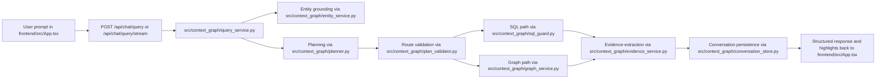

# Context Graph Architecture

This repository implements a grounded context graph system for an SAP order-to-cash dataset. The system is organized as a layered application: raw dataset ingestion, semantic normalization, SQL-first analytics, graph projection, query orchestration, and a graph-plus-chat UI.

All project references below use repository-relative paths only.

## Architecture Goals

- Keep the dataset as the source of truth while projecting it into a graph for exploration.
- Use SQL and curated semantic views for authoritative analytics.
- Use the model as a planner and explainer, never as the source of truth.
- Reject out-of-domain requests instead of inventing answers.
- Preserve explicit evidence, citations, and errors through the full request path.

## Top-Level Layout

- `src/context_graph/`
  Core backend package: ingestion pipeline, semantic model, runtime services, API, graph service, planner integration, validation, and query orchestration.
- `frontend/`
  React + TypeScript client for graph exploration and chat.
- `scripts/`
  Build and notebook generation entrypoints.
- `notebooks/`
  Notebook artifact for the notebook-first milestone.
- `tests/`
  API, routing, search, clustering, and streaming tests.
- `artifacts/`
  Generated SQLite warehouse, graph exports, semantic catalog, and reports.
- `sap-o2c-data/`
  Raw SAP-style dataset input used by the build pipeline.

## System Layers

### 1. Ingestion and Normalization

The ingestion layer scans the fragmented dataset, profiles schemas, normalizes types, and materializes canonical business tables plus bridge tables.

Primary files:

- `src/context_graph/io.py`
- `src/context_graph/normalize.py`
- `src/context_graph/bridges.py`
- `src/context_graph/semantic.py`
- `src/context_graph/pipeline.py`
- `scripts/build_context_graph.py`

Responsibilities:

- Read fragmented JSONL extracts from `sap-o2c-data/`
- Normalize identifiers, dates, amounts, quantities, and nulls
- Materialize canonical tables for sales orders, deliveries, billing, journal entries, payments, customers, products, plants, and assignments
- Derive bridge tables that resolve document flow across fragmented references
- Persist the normalized warehouse in `artifacts/sqlite/context_graph.db`

Output shape:

- Staging tables for raw ingestion provenance
- Canonical fact and dimension tables
- Bridge tables for order-to-delivery, delivery-to-billing, billing-to-journal, and journal-to-payment
- Curated SQL views used by the query layer

### 2. Semantic SQL Layer

The semantic layer is the analytical contract exposed to the planner and SQL validator. The model does not query raw ingestion tables directly.

Primary files:

- `src/context_graph/catalog_service.py`
- `src/context_graph/config.py`
- `src/context_graph/sql_guard.py`

Approved analytical surfaces:

- `v_sales_order_flow`
- `v_delivery_flow`
- `v_billing_flow`
- `v_financial_flow`
- `v_customer_360`
- `v_product_billing_summary`
- `v_incomplete_order_flows`
- `v_billing_trace`

Why this layer exists:

- Keep business joins stable and centralized
- Constrain the planner to a small approved schema
- Make SQL validation practical
- Improve reproducibility of analytics and anomaly detection

### 3. Graph Projection

The graph layer projects canonical data into a graph of typed nodes and edges. SQL remains the system of record; the graph is a derived context structure optimized for exploration and lineage.

Primary files:

- `src/context_graph/graph.py`
- `src/context_graph/graph_service.py`
- `src/context_graph/evidence_service.py`

Node families:

- Transaction nodes: sales order, sales order item, schedule line, delivery, delivery item, billing document, billing item, journal entry, payment
- Master/reference nodes: customer, address, product, plant, storage location, company code, sales area

Edge families:

- Flow edges: `HAS_ITEM`, `HAS_SCHEDULE_LINE`, `FULFILLED_BY`, `PART_OF_DELIVERY`, `BILLED_AS`, `PART_OF_BILLING`, `POSTED_TO`, `SETTLED_BY`, `CANCELS`
- Master-data edges: `ORDERED_BY`, `DELIVERED_TO`, `HAS_ADDRESS`, `REFERS_TO_PRODUCT`, `SHIPPED_FROM`, `AVAILABLE_AT`, `STORED_AT`, `ASSIGNED_TO_COMPANY`, `ASSIGNED_TO_SALES_AREA`

Graph behavior:

- Full graph is loaded in backend memory
- UI receives focused subgraphs only
- Path tracing uses directional flow traversal
- Combined subgraphs connect multiple resolved entities
- Type clustering can collapse dense same-type neighborhoods into synthetic cluster nodes

### 4. Query Orchestration

The query layer decides how a natural-language request is handled: SQL analytics, graph traversal, or hybrid behavior.

Primary files:

- `src/context_graph/query_service.py`
- `src/context_graph/plan_validator.py`
- `src/context_graph/entity_service.py`
- `src/context_graph/conversation_store.py`
- `src/context_graph/planner.py`

Execution flow:

1. Load conversation context and selected graph state
2. Ground the prompt with candidate entity matches from search
3. Short-circuit clear direct entity lookups when deterministic grounding is sufficient
4. Otherwise ask the model for a validated structured plan
5. Validate route, intent, and entity requirements
6. Execute either:
   - graph traversal
   - SQL generation + SQL validation + SQL execution
   - hybrid SQL with graph evidence projection
7. Compose the final answer from executed evidence only
8. Persist conversation state, citations, and highlights

Current route model:

- `sql`
  Aggregate analytics and anomaly-oriented queries over approved views
- `graph`
  Entity lookup, relationship exploration, and document-trace style questions
- `hybrid`
  SQL-backed analytics plus graph highlighting for returned entities

### 5. Guardrails and Validation

The system is intentionally restrictive.

Primary files:

- `src/context_graph/sql_guard.py`
- `src/context_graph/plan_validator.py`
- `src/context_graph/exceptions.py`

Guardrail boundaries:

- No raw-table SQL from the planner
- No write queries
- No hidden fallback answers
- No fabricated graph links
- No out-of-domain general knowledge responses

Validation happens at multiple layers:

- Entity resolution
- Query-plan route validation
- SQL allowlist validation
- Read-only execution constraints
- Row-bound and timeout enforcement

### 6. Conversation Memory

Conversation state is structured and persisted in SQLite rather than being kept only in transient frontend state.

Primary files:

- `src/context_graph/conversation_store.py`
- `src/context_graph/schemas.py`

Stored memory layers:

- Recent turns
- Selected node state
- Resolved entities
- Highlighted node state
- Active filter state
- Last intent and route

This supports follow-up questions like reusing the previously resolved entity even when the next turn omits the identifier explicitly.

### 7. API Layer

The API is exposed through FastAPI and serves both JSON endpoints and a streamed chat response.

Primary files:

- `src/context_graph/api.py`
- `src/context_graph/main.py`
- `src/context_graph/runtime.py`

Main endpoints:

- `GET /api/health`
- `GET /api/entities/search`
- `GET /api/entities/{node_id}`
- `GET /api/graph/subgraph`
- `GET /api/graph/path`
- `POST /api/chat/query`
- `POST /api/chat/query/stream`

Streaming contract:

- The stream returns newline-delimited JSON events
- Event types include conversation initialization, planning status, execution readiness, answer deltas, and the final structured payload

### 8. Frontend Layer

The UI is a two-pane application: graph exploration on the left and streamed conversational analysis on the right.

Primary files:

- `frontend/src/App.tsx`
- `frontend/src/api.ts`
- `frontend/src/types.ts`
- `frontend/src/styles.css`

Frontend responsibilities:

- Search for entities
- Request subgraphs and document traces
- Toggle graph clustering
- Render Cytoscape nodes and edges with selection and highlighting
- Display a streamed chat thread with user turns and assistant turns in one shared conversation space
- Open node detail in a draggable in-graph popover

## Request Lifecycle

## Runtime Composition

`src/context_graph/runtime.py` builds the application runtime and wires the main services together:

- `CatalogService`
- `EntityService`
- `GraphService`
- `OpenAIPlanner`
- `SqlValidator`
- `SqlExecutor`
- `ConversationStore`
- `EvidenceService`
- `QueryPlanValidator`
- `QueryService`

This keeps dependency wiring in one place and avoids mixing application bootstrap with route handlers.

## Artifact Model

Generated assets are written to `artifacts/` and consumed by both the notebook and the runtime app.

Key outputs:

- `artifacts/sqlite/context_graph.db`
  Canonical warehouse, semantic views, graph tables, and conversation-memory tables
- `artifacts/graph/graph_nodes.csv`
  Node export for offline inspection
- `artifacts/graph/graph_edges.csv`
  Edge export for offline inspection
- `artifacts/reports/semantic_catalog.json`
  Semantic glossary and approved-view catalog
- `artifacts/reports/quality_report.json`
  Data quality and normalization diagnostics
- `artifacts/reports/acceptance_checks.json`
  Golden data checks and expected dataset validation

## Test Coverage

Architecture-sensitive tests live under `tests/`.

Notable coverage areas:

- `tests/test_api.py`
  API health, search, graph pathing, cluster-mode response, and stream endpoint structure
- `tests/test_query_service.py`
  Graph-route execution, direct entity lookup grounding, stream event emission, and conversation memory reuse
- `tests/test_settings.py`
  Environment and model-provider configuration mapping

## Design Decisions

- SQL is the truth layer; graph is a projection layer
- The model plans and explains but does not supply authoritative data
- Short direct entity lookups can be grounded deterministically before planning
- Errors are returned explicitly instead of being hidden behind generic answers
- Relative architectural boundaries are encoded directly in `src/context_graph/` instead of being spread across the frontend and scripts
